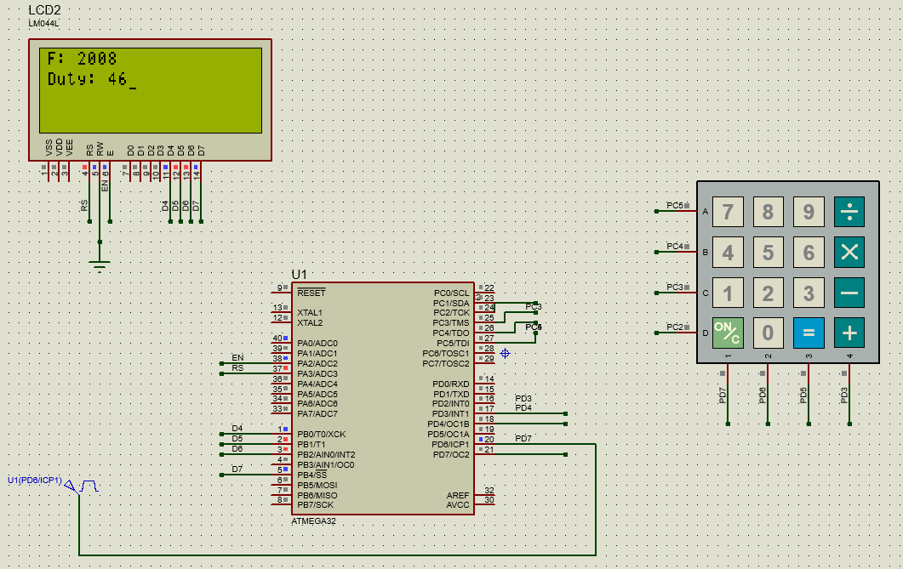
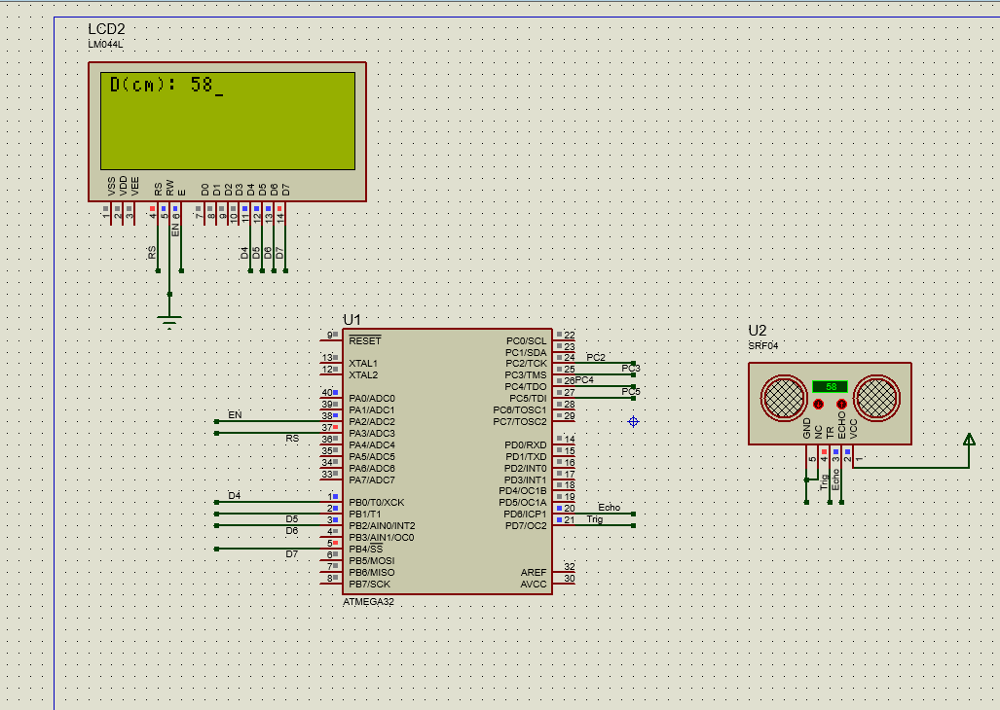

# nti-avr interfacing

- To build a specific application use `make app_name`
- To test on proteus, open simulation/project_name and load the hex file and test.

### Testing Input Capture Unit (ICU)
1. build the project called ICU_app
	
	`make ICU_app`
 
 you should see .elf and .hex files generated

2. Open Simulation/ICU_app, load the hex file manually if not loaded and run.
3. Modify the freq and duty cycle of the clock generator and you should see the results, duty cycle & frequency printed on the 	lcd

### Testing Ultrasonic
1. build the project
	
	`make Ultrasonic`
 
 you should see .elf and .hex files generated

2. Open Simulation/Ultrasonic, load the hex file manually if not loaded and run.
3. Modify the distance and you should see the results printed on the lcd
